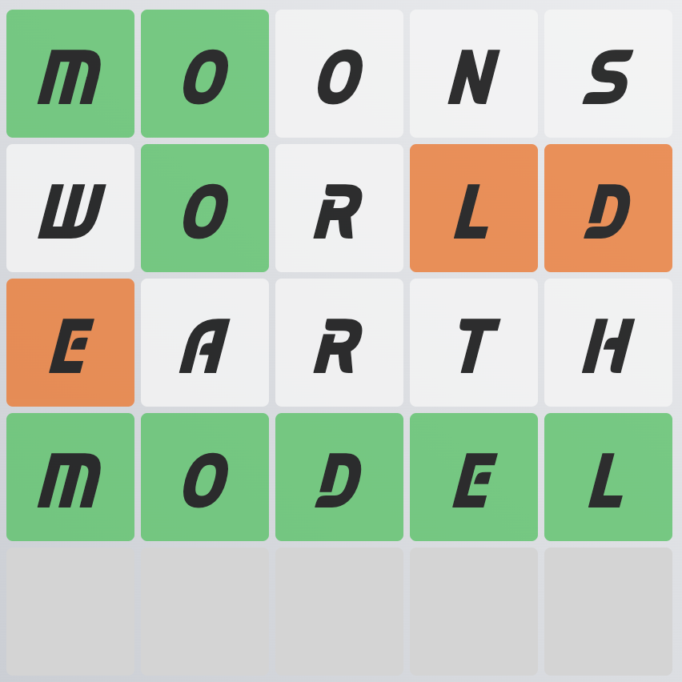

# Wordly

Wordly is a fun and engaging word game built with React, TypeScript, and JavaScript.

## Installation

Before you start, make sure you have Node.js and npm installed on your machine.

1. Clone this repository:

    ```bash
    git clone https://github.com/AymanAkashi/wordly
    ```

2. Navigate into the project directory

    ```bash
    cd wordly
    ```

3. Install the dependencies:
    ```bash
    npm install
    ```

## Usage

```bash
npm run build && npm start
```

Then, open your web browser and navigate to [http://localhost:3000](http://localhost:3000).

### Game Rules

#### Goal:

Guess a five-letter word within six tries.

#### GamePlay:



1. You start with a blank grid of five empty squares.
2. You guess a valid five-letter word and submit it.
3. The game provides color-coded feedback for each letter of your guess:

-   Green: The letter is correct and in the right position.
-   Yellow: The letter is in the word, but in the wrong position.
-   Gray: The letter is not in the word at all.

4. Use the color clues to refine your next guess.
5. You have six tries in total to guess the correct word.
